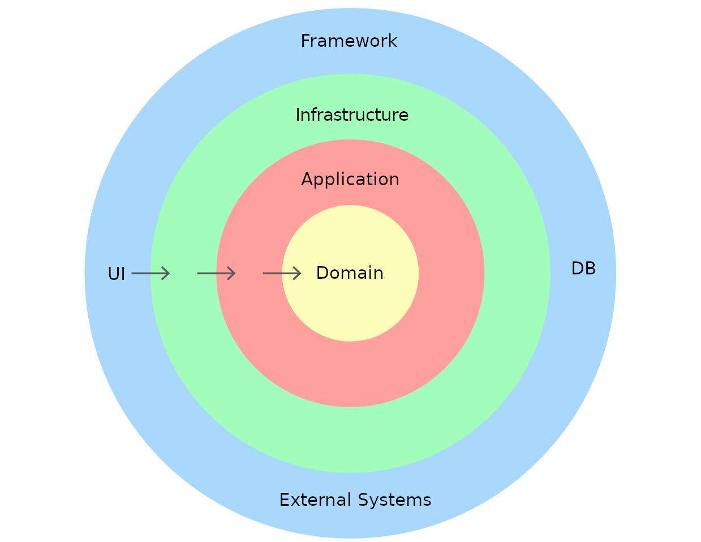

#recipe-sharing-challenge-java

Application area
This architecture is recommended for Java applications containing (possibly in the future) non-trivial business logic.
Examples of applications for such an architecture may not be appropriate:

1) CRUD services. However, consider whether your application really needs to be a CRUD service?
Or will it always be a CRUD service?
2) API front, i.e. backend-services, the main responsibility is to interact with frontend services 
using API and transfer data to other backend services.
3) The simplest adapter applications.

The main idea is decomposition on layers
There are three basic layers: the domain layer, the application layer, and the infrastructure layer
1) The domain layer defines the domain model and business rules.
   - Layer components: domain objects (Domain objects) and domain services (Domain services).
   - Among the business rules, the following can be distinguished: validation rules, calculation logic, criteria.
   - This layer cannot access external systems and databases (even through an interface), all necessary data must be 
passed through method arguments.
   - This layer does not depend on other layers of the application, and dependencies on libraries are minimized.
2) Application layer defines scenarios for solving specific problems of the application.
   - Layer components: application-level services (Application services) and port interfaces (Ports)
   - This layer implements the application logic through the use of domain layer components, databases and external 
systems.
   - Access to the database and external systems is made through the interface-ports defined in this layer and 
implemented in the infrastructure layer.
   - This layer depends on the domain layer, but not on the infrastructure layer. Library dependencies are also kept 
to a minimum.
3) The Infrastructure layer is the assembly point and configuration of the application, provides an interface for 
interacting with the application, and also provides infrastructure services for use in the application layer.
   - Layer components: configuration classes, controllers, handlers (Listeners), repositories, adapters for accessing
external services, as well as adapters for libraries such as Camunda.
   - This layer can depend on both the domain layer and the application layer. Libraries are free to use.

Dependency arrows goes from more abstract to more concrete, from the edges (infra) to core of the application (domain).
You chose which framework and libraries are allowed to use in domain and app layers (It will probably be hard to give up
Spring or may be you custom framework)

It is optional to divide layers into modules and use checkstyle import control for check imports